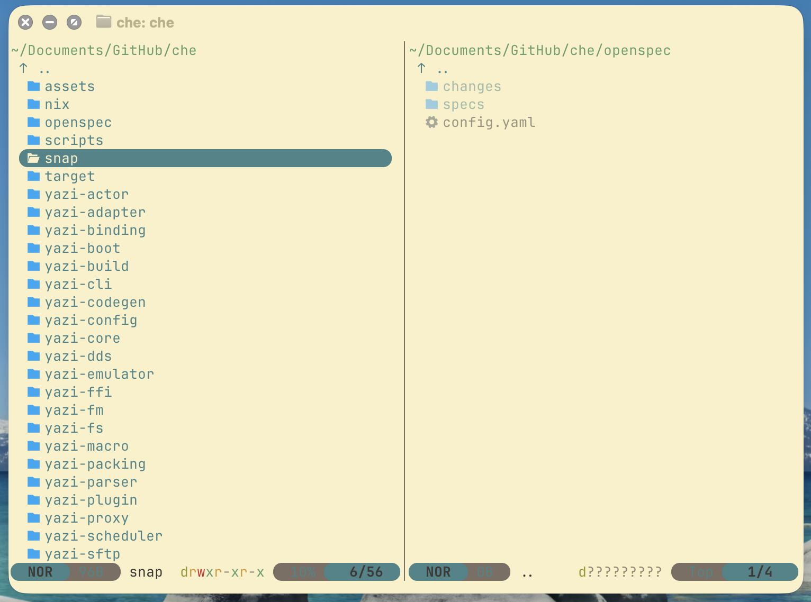

# che — ⚡ Dual-Pane Terminal File Manager

[](LICENSE)

**che** is a modern, blazing-fast dual-pane terminal file manager written in Rust and built on non-blocking async I/O. It combines the convenience and efficiency of classic dual-pane file managers (Total Commander, Double Commander, Midnight Commander) with the powerful architecture and rich plugin ecosystem of Yazi.


---

## 💡 Motivation

I really like dual-pane file managers, but everything I see on platforms other than Windows feels quite limited. I wanted a simple, fast, and feature-rich dual-pane file manager.

The Ranger-style layout (continuous nested columns) adopted by Yazi and almost all modern terminal file managers doesn't quite fit my workflow. However, **Yazi is an incredibly powerful, fast file manager with an excellent architecture and plugin ecosystem**.

Instead of building everything from scratch, I created a fork and reimagined it around a native dual-pane experience.

---

## ⚡ Key Features & Differences from Yazi

Unlike standard Yazi, **che** elevates the dual-pane workflow to a first-class citizen and builds upon it with enhanced functionality:

1. **Dual-Pane Mode by Default**:
   * Launches directly into a dual-pane interface with two independent file columns.
   * Toggle to single-pane mode using the `--single` CLI flag or press `Ctrl+W o`.
2. **Native Cross-Pane File Operations (MC/DC Style)**:
   * **`F5` / `Shift+F5`**: Copy selected files/folders to the opposite pane (`Shift` forces overwrite).
   * **`F6` / `Shift+F6`**: Move selected files/folders to the opposite pane (`Shift` forces overwrite).
   * **`=`**: Synchronize opposite pane directory to match the current pane's CWD.
3. **Double Commander Style Overwrite Dialog** (`overwrite_dialog = true`):
   * Comprehensive conflict popup with inline hotkeys: `[O]verwrite`, `Overwrite [A]ll`, `Overwrite Ol[d]er`, `[S]kip`, `Skip A[l]l`, `Auto [R]ename`, `Co[m]pare`, `[C]ancel`.
4. **Fast Disk & Volume Picker** (`g m` / `disks`):
   * Cross-platform disk and mounted volume selector.
   * Single matching drive opens immediately on keypress (e.g. `s` for `soft`) without pressing Enter. Multiple matches cycle selection iteratively.
5. **Letter Jump Navigation Mode (`JUMP`)**:
   * Toggle with `Ctrl+J`. Mappings allow instant cursor jumping to matching filenames by typing their initial letter.
6. **Smart Auto-Switch to Glob Search** (`smart_glob = true`):
   * Searching with wildcards (e.g. `*.py`, `*.txt`) automatically activates `--glob` in `fd`, while standard regular expressions (e.g. `.*\.py`) continue evaluating as regex.
7. **File Comments Support (`descript.ion`)**:
   * Press `c m` (`comment`) to add, view, or edit file comments stored in `descript.ion`.
8. **Batch Rename Inline Hotkeys (`multirename`)**:
   * Action buttons feature instant hotkey triggers: `Alt+O` (`[O]K`) and `Alt+C` (`[C]ancel`).
9. **Virtual Parent Directory Listing** (`show_upparent = true`):
   * Displays `↑ ..` as the top entry in file lists for fast mouse and keyboard parent navigation.
10. **Audio Previewer & Album Art Display**:
    * Integrated previewer for MP3, FLAC, M4A, and WAV files with album art extraction via `ffmpeg` / `exiftool`.

---

## 🔌 Yazi Compatibility: Configs & Plugins

**`che` is 100% compatible with the Yazi ecosystem!**

* **Yazi Plugins**: Any Lua plugin written for Yazi (such as `starship.yazi`, `git.yazi`, or `mount.yazi`) works out of the box in `che`. `che` implements per-pane Lua state isolation for header components, allowing plugins like `starship.yazi` to render independent prompts for both left and right panes concurrently without code modifications.
* **Yazi Configuration**: All configuration sections and options from `yazi.toml`, `keymap.toml`, and `theme.toml` are fully supported.

---

## 🛠 Installation

### macOS & Linux (Homebrew)

```bash
brew tap aroum/che
brew install che
```

To upgrade:

```bash
brew update && brew upgrade che
```

### Build from Source (Cargo)

Requires Rust toolchain (1.78+):

```bash
## 📦 Installation

### 🍺 Homebrew (macOS & Linux)
```bash
brew tap aroum/che
brew install che
```

### 🪟 Windows Package Manager (Winget)
> ⏳ **Winget (Coming Soon)** — Package submission to Microsoft (`winget install aroum.che`) is currently under review ([PR #407686](https://github.com/microsoft/winget-pkgs/pull/407686)).

### 🐧 Snapcraft (Linux)
```bash
snap install che-fm
```

### ❄️ Nix (Flakes)
```bash
nix run github:aroum/che
```

### 🛠 Building from Source
```bash
git clone https://github.com/aroum/che.git
cd che
cargo build --release
```

The compiled binaries (`che` and short alias `ch`) will be located in `target/release/`.

---

## 📁 Configuration Path

Configuration files for `che` are isolated in their own directory, ensuring zero conflict with standard Yazi installations:

* **Config Directory**: `~/.config/che/`
  * `yazi.toml` — Primary configuration settings.
  * `keymap.toml` — Custom keybindings.
  * `theme.toml` — UI theme definitions.
  * `plugins/` — Custom Lua plugins.

### New Options in `yazi.toml`

Customize `che`-specific features in `~/.config/che/yazi.toml`:

```toml
[mgr]
# Automatically switch to glob mode for wildcard patterns (*.py, *.txt)
smart_glob = true

# Display "↑ .." entry at the top of directory listings
show_upparent = true

# Completely hide cursor and side markers in inactive pane (true = hidden by default, false = dimmed second cursor)
hide_inactive_cursor = true

[input]
# Esc key behavior in input dialogs
# false - Single Esc press immediately closes dialog (default)
# true  - First Esc switches to Vim Normal mode, second Esc closes
vim_mode = false

# Auto-highlight filename stem excluding extension during rename
rename_highlight_stem = true

cursor_blink = false

[confirm]
# Double Commander style overwrite confirmation dialog
overwrite_dialog = true
```

### Command Line Flags (CLI)

* **`che`** — Launches in default dual-pane mode.
* **`che --single`** — Launches in single-pane mode.
* **`che --debug`** — Enables verbose debug event logging.

---

## ⌨️ Keybindings & Menu Commands

### Pane Navigation & Management

| Keybinding                      | Command (`run = ...`) | Description                                    |
| :------------------------------ | :-------------------- | :--------------------------------------------- |
| **`Tab`** / **`Shift+Tab`**     | `pane_switch`         | Switch focus between left and right panes      |
| **`Ctrl+W h`** / **`Ctrl+W l`** | `pane_focus`          | Focus left / right pane directly               |
| **`Ctrl+W o`**                  | `dual_toggle`         | Toggle between dual-pane and single-pane modes |
| **`Ctrl+W p`**                  | `preview_toggle`      | Toggle preview pane visibility                 |
| **`=`**                         | `sync_pane`           | Synchronize opposite pane CWD with active pane |
| **`F5`** / **`Shift+F5`**       | `copy_to`             | Copy selected items to opposite pane           |
| **`F6`** / **`Shift+F6`**       | `move_to`             | Move selected items to opposite pane           |

### New Features & Jump Mode

| Keybinding                       | Command (`run = ...`) | Description                                 |
| :------------------------------- | :-------------------- | :------------------------------------------ |
| **`Ctrl + J`**                   | `jump_mode`           | Toggle letter jump navigation mode (`JUMP`) |
| **`g` `m`**                      | `disks`               | Open disk and volume selection picker       |
| **`c` `m`**                      | `comment`             | Add / edit file comment (`descript.ion`)    |
| **`Ctrl+Shift+R`** / **`c` `r`** | `plugin multirename`  | Launch batch multirename plugin             |
| **`Ctrl+Shift+Y`** / **`c` `y`** | `plugin system_copy`  | Copy selected files to OS system clipboard  |

---

## 🚚 Migration from Yazi

Migrating your setup from Yazi to **che** takes just a few seconds:

1. **Copy configuration files**:

   ```bash
   mkdir -p ~/.config/che
   cp -r ~/.config/yazi/* ~/.config/che/
   ```

2. **Copy plugins and theme data**:

   ```bash
   mkdir -p ~/.local/share/che
   cp -r ~/.local/share/yazi/* ~/.local/share/che/ 2>/dev/null || true
   ```

3. **Launch `che`**:

   ```bash
   che
   ```

All existing plugins, keymaps, and themes will function seamlessly in **che**!

---

## 📜 License

Distributed under the MIT License. See [LICENSE](LICENSE) for more details.
